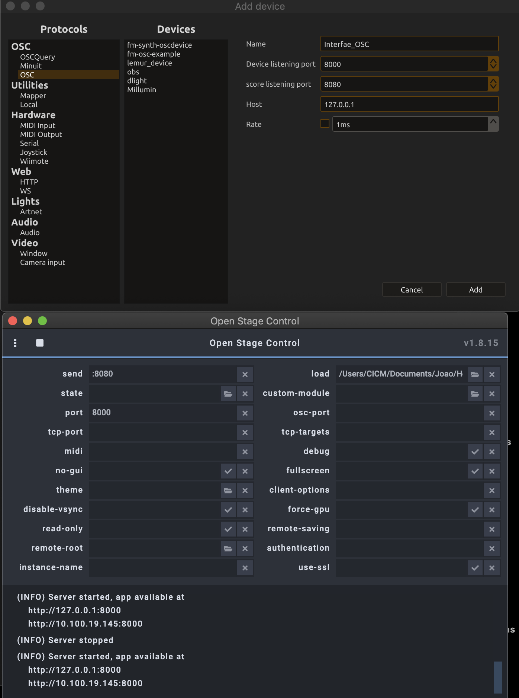

  <h1 align="center">HermesV2 </h1>
  

    network music piece (2020-2022) by João Svidzinski
  

***

## Software list

- [Max 8](https://cycling74.com/products/max)
- [Hoa library](https://hoalibrary.mshparisnord.fr/)
- [OSSIA SCORE](https://ossia.io/)
- [Open Stage Control](http://openstagecontrol.ammd.net/)

# Max dependency

All dependency is already included in */Patch Max/_external* folder.
However, the Faust binary (*mTDelHarmo7E~.mxo*, *jgrain7~.mxo*, ) should be recompiled. The .dsp files could be find in the link below.
The other Faust codes (*compresseur~.mxo* and *flanger7B~.mxo*) are in */faust* folder.

- [Antescofo](https://forum.ircam.fr/projects/detail/antescofo/)
- [OSSIA Max](https://ossia.io/site-libossia/download.html#max-binding)

- [Granulateur matriciel](https://github.com/JoaoSvidzinski/granulateur-matriciel)
- [mTDelHarmo](http://alainbonardi.net/telechargements/_mTDelHarmo_v_1_2.zip)

## Patch installation

1. Download or clone *HermesV2*
2. In *Max 8*, choose *.../Patch Max* in *option* > *File preferences*
3. Check the *Audio status* in *option > Audio Status*:
4. Close max and open *___Hermes_V2-8ch-2022-Final.maxpat&nbsp;*(red label)

## Initialisation routine
# Open Stage Contotrol and Ossia Score initialisation routine

- Download and install all the Software (see list above)
- Open **Open Stage Control** and load the */OpenStageControl/_hermes-tab.json* file.
- Configure the send and port as the picture below.

-Open **OSSIA SCORE** and load */OSSIA SCORE/__hermes_2022_Final.score* scenario
- Configure the send and port as the picture below.

# Max initialisation routine

- Open *Patch Max/__Score.maxpat* Patch
- Hit the *expose oscquery 2349 4932* message.

- Open *Patch Max/___Hermes_V2-8ch-2022-Final.maxpat* Patch
- Configure audio status (see DSP status below).
- Turn on the DSP

# Audio Setup

Sampling rate = 48000
I/O Vector Size = 512
Signal Vector Size = 256
Scheduler in Overdrive X

## Max initialisation routine

- After performing all the initialization steps above, all software must remain open
- Open the GUI in a browser with the ip address given by Open Stage Control
- Lunch the Ossia scenario (hit the space bar)
- Play the piece !!!

## disclaimer

The current documentation only refers to local network performance (with 8 loudspeaker). The web version is under development
